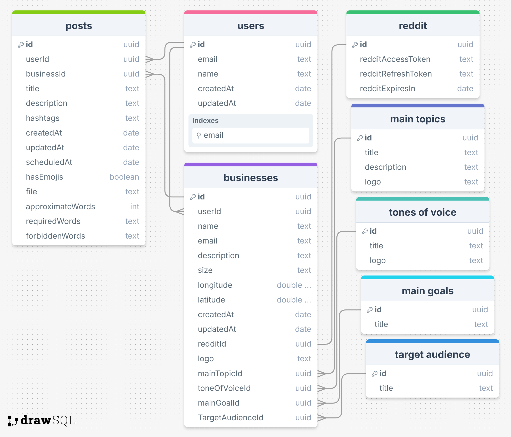

# Postify

**Postify** is an AI marketing agency platform. It empowers marketing agencies and freelancers to streamline their content creation workflows — enabling them to generate, schedule, and manage social media campaigns with AI assistance, real-time collaboration, insights analysis, and automated publishing across multiple platforms.

## Tech Stack

Node.js (Typescript) | Express | PostgreSQL | Prisma | Socket.io | Redis | Docker | GitHub Actions | Azure

## Database Design



## Installation

```bash
# Install dependencies
npm install

# Generate Prisma client
npx prisma generate

# Run the app
npm run dev # development
# or
npm run build && npm start # production
```
